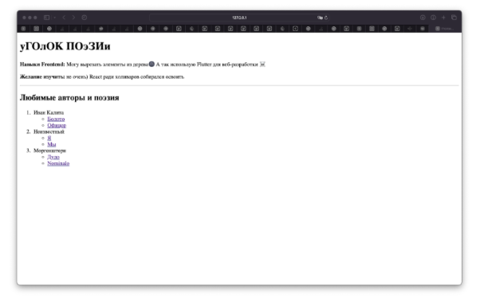

# ВВЕДЕНИЕ

## Обзор технологии

Выполнение операторов (кнопка или команда ! Выполнить/! Extcute) приведет к созданию базы данных. В данном случае имя БД – Университет (имя БД должно быть уникально в рамках сервера), оператор use задает БД, используемую по умолчанию, master – имя системной БД, создаваемой автоматически при установке MS SQL. Созданная база данных появляется в дереве объектов(окно Обозреватель объектов/Object Explorer) после обновления узла Базы данных/Databases (команда контекстного меню Обновить/Refresh). Удаление БД реализует оператор drop database, имеющий аналогичный синтаксис.

## Цель работы

Приобретение навыков создания web-документов, структурирования и оформления текста средствами HTML 5.0, а также создания текстовых и графических гиперссылок.

## Задание

**1 Часть:** создайте web-страницу с кратким текстом о себе и наличии (отсутствии) подготовки в области web-технологий, о заинтересованности в овладении этой областью информационных технологий. Текст должен начинаться с заголовка 1-го уровня, затем следует поместить текст, написанный базовым шрифтом.

Далее вставьте горизонтальную черту, добавьте 2-3 пустые строки, после чего напишите заголовком 2-го уровня текст «Мои любимые поэты и их произведения» и создайте вложенный список: нумерованный список с фамилиями поэтов (двух-трех), а внутри каждого элемента нумерованного списка напишите в виде маркированного списка названия стихотворений этого поэта (не более двух-трех).

Создайте 2-ю веб-страницу, на которой поместите тексты стихотворений (или их фрагменты), которые Вы перечислили на 1-ой странице. Для выделения названий стихотворений используйте специальные теги заголовков.

**2 Часть:** на 1-ой веб-странице создайте из названий стихотворений поэтов гиперссылки, обеспечивающую переход на текст соответствующего стихотворения на 2-ой странице.

Создайте гиперссылку, нацеленную на текстовый документ с расширением .docx для его последующей загрузки.

На 2-ой веб-странице внизу сделайте графическую гиперссылку для возврата на 1-ю веб-страницу. В качестве изображения может быть взята ваша фотография или аватарка.
Создайте почтовую гиперссылку.

Посмотрите и сравните созданные Вами страницы в разных браузерах.

# ВЫПОЛНЕНИЕ РАБОТЫ

Для выполнения поставленного задания были разработаны HTML-страницы, охватывающие все необходимые функциональные элементы. Кроме того, мы приложили усилия для улучшения визуального восприятия путем внедрения CSS-стилей, обеспечивающих гармоничный дизайн и четкую структуру контента. Исходный код доступен на GitHub (URL:https://github.com/vladcto/suai-labs/tree/dba4eb7f0d6da0594c9af3338a3f4ddb1ade2010/6_semester/Web/1) 

В процессе разработки были также интегрированы JS-скрипты с целью обеспечения более интерактивного пользовательского опыта. Эти скрипты были тщательно протестированы на совместимость с различными браузерами, включая Google Chrome и Safari, чтобы гарантировать однозначное функционирование на различных платформах.

Осуществленное тестирование в указанных браузерах позволило нам удостовериться в стабильной работе разработанных элементов на популярных веб-платформах. Результаты тестирования изображены на рисунках 1-3.




# ВЫВОД

В ходе выполнения работы были получены навыки web-разработки, а также выполнены поставленные задачи. Разработанные HTML-страницы включают в себя все необходимые функциональные элементы, обеспечивая полноценное функционирование веб-приложения.

Особое внимание уделялось визуальному восприятию пользователей, что было достигнуто благодаря аккуратному применению CSS-стилей. Эти стили создают гармоничный дизайн и подчеркивают четкую структуру контента, что, в свою очередь, способствует удобству использования разработанного веб-приложения.

Интеграция JS-скриптов добавила интерактивности пользовательскому опыту, придавая приложению дополнительные функциональные возможности. Тщательное тестирование на различных браузерах, таких как Google Chrome и Safari, гарантирует стабильное и однозначное функционирование на различных платформах.

# СПИСОК ИСПОЛЬЗОВАННЫХ ИСТОЧНИКОВ <suaidoc-center>

Интеграция JS-скриптов добавила интерактивности пользовательскому опыту, придавая приложению дополнительные функциональные возможности. Тщательное тестирование на различных браузерах, таких как Google Chrome и Safari, гарантирует стабильное и однозначное функционирование на различных платформах.

Интеграция JS-скриптов добавила интерактивности пользовательскому опыту, придавая приложению дополнительные функциональные возможности. Тщательное тестирование на различных браузерах, таких как Google Chrome и Safari, гарантирует стабильное и однозначное функционирование на различных платформах.

Интеграция JS-скриптов добавила интерактивности пользовательскому опыту, придавая приложению дополнительные функциональные возможности. Тщательное тестирование на различных браузерах, таких как Google Chrome и Safari, гарантирует стабильное и однозначное функционирование на различных платформах.

Интеграция JS-скриптов добавила интерактивности пользовательскому опыту, придавая приложению дополнительные функциональные возможности. Тщательное тестирование на различных браузерах, таких как Google Chrome и Safari, гарантирует стабильное и однозначное функционирование на различных платформах.

# ПРИЛОЖЕНИЕ <suaidoc-center>

```html
<!DOCTYPE html>
<html>sd
  <head>
    <title>Уголок поэзии</title>
  </head>

  <body>
    <h1 id="bob">Уголок поэзии</h1>

    <p>
      <b>Навыки Frontend:</b> Могу вырезать элементы из дерева
      <a href="https://github.com/vladcto/suai-labs/raw/main/6_semester/Web/web1.docx">🌚</a>
      А так использую Flutter для веб-разработки ☠️
    </p>
    <p><b>Желание изучить:</b> не очень) React ради холиваров собирался освоить</p>

    <hr />

    <h2>Любимые авторы и поэзия</h2>

    <ol>
      <li>
        Иван Калита
        <ul>
          <li><a href="poetry.html#spb">Болото</a></li>
          <li><a href="poetry.html#prank">Офицер</a></li>
        </ul>
      </li>
      <li>
        Неизвестный
        <ul>
          <li><a href="poetry.html#omg">Я</a></li>
          <li><a href="poetry.html#omg2">Мы</a></li>
        </ul>
      </li>
      <li>
        Моргенштерн
        <ul>
          <li><a href="poetry.html#dulo">Дуло</a></li>
          <li><a href="poetry.html#nominalo">Nominalo</a></li>
        </ul>
      </li>
    </ol>
  </body>

  <script src="assets/scripts/sponjonizer.js"></script>
</html>

<!DOCTYPE html>
<html>
  <head>
    <title>Поэзия</title>
    <link rel="stylesheet" type="text/css" href="style.css" />
    <link href="http://fonts.googleapis.com/css?family=Roboto" rel="stylesheet" type="text/css" />
  </head>

  <body>
    <h1 style="text-align: center">Поэзия</h1>
    <div class="grid-container">
      <h2>Неизвестный</h2>
      <h2>Иван Калита</h2>
      <h2>Моргенштерн</h2>
      <div id="omg"></div>
      <div id="spb"></div>
      <div id="dulo"></div>
      <div id="omg2"></div>
      <div id="prank"></div>
      <div id="nominalo"></div>
    </div>

    <div class="footer-container">
      <a href="main.html">
        
      </a>
      <a href="mailto:vladctocrytoe@mail.ru">amogus@mail.ru</a>
    </div>
  </body>

  <script src="assets/scripts/map_id_to_poetry.js"></script>
</html>
```