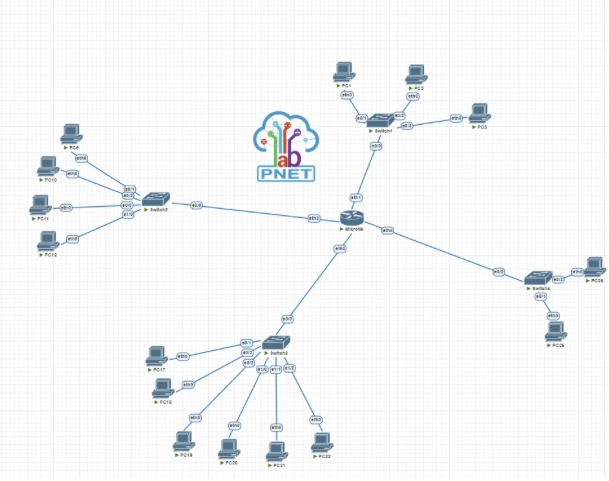

<!-- markdownlint-disable single-title -->
# Hello 1

По ТЗ мы имеем маску $255.255.255.224 /27.$

/27 означает, что у нас есть 32 - 27 = 5 бит, которые мы можем использовать для хостов.  Количество доступных адресов равно = $2 ^ 5 - 2$ (сетевой и широковещательный)  = 32 - 2 = 30

1. Например для подсети 192.168.1.0/27:

   1. Начальный адрес (Network Address): 192.168.1.0

   2. Конечный адрес (Broadcast Address): 192.168.1.31

2. Диапазон хостов: 192.168.1.1 - 192.168.1.30

- Например для подсети 192.168.1.0/27:

  - Начальный адрес (Network Address): 192.168.1.0

  - Конечный адрес (Broadcast Address): 192.168.1.31

- Диапазон хостов: 192.168.1.1 - 192.168.1.30

```python
print("hello")
print("hello")
	print("hello")
	print("hello")
		print("hello")
		print("hello")
			print("hello")
			print("hello")
print("hello")
print("hello")
	print("hello")
	print("hello")
		print("hello")
		print("hello")
			print("hello")
			print("hello")
```

Настроили все порты на коммутаторе Switch-1, связанные с ПК. В режиме конфигурации портов (interface range) присвоили описание, установили режим доступа с "switchport mode access" и привязали порты к соответствующим VLAN с помощью "switchport access vlan [номер VLAN]". Затем, с использованием "exit", вышли из режима настройки портов, и через "do show run" просмотрели текущие конфигурационные настройки коммутатора Switch-1 без выхода из режима настройки. Результат работы “do show run” представлен на рисунке 3.

## Sub Hello Sub Hello Sub Hello Sub Hello Sub Hello Sub Hello Sub Hello Sub Hello Sub Hello Sub Hello Sub Hello Sub Hello Sub Hello Sub Hello Sub Hello Sub Hello Sub Hello Sub Hello Sub Hello Sub Hello Sub Hello Sub Hello Sub Hello Sub Hello Sub Hello Sub Hello

sdasdsadsad

# ВВЕДЕНИЕ
Локальная вычислительная сеть (ЛВС) представляет собой коммуникационную систему, объединяющую компьютеры и периферийное оборудование в ограниченной географической зоне, чаще всего в пределах нескольких зданий или единого предприятия. В настоящее время ЛВС стала интегральной частью вычислительных систем, включающих в себя более одного компьютера.

Основные выгоды, предоставляемые ЛВС, заключаются в возможности эффективного совместного функционирования и оперативного обмена данными, централизованном хранении информации, а также обеспечении общего доступа к общим ресурсам, таким как принтеры, сеть Интернет и другие.

Дополнительно, ЛВС играет важную роль в создании отказоустойчивых систем, способных поддерживать работоспособность при частичном выходе из строя отдельных компонентов. Этот аспект достигается за счет использования избыточности и дублирования, а также гибкости функционирования отдельных компонентов сети.

На сегодняшний день ЛВС получили широкое распространение в масштабах всего мира. Этому способствуют различные факторы, такие как возможность удаленного взаимодействия пользователей в сети и экономия ресурсов предприятий за счет оптимизации затрат на обслуживание вычислительных систем. В данной курсовой работе будут рассмотрены этапы построения локальных сетей, включая выбор технологий, организацию и настройку параметров сетевого оборудования, а также выбор технических средств и представление логического расчета структуры сети.

Цель исследования: тщательный анализ современных сетевых технологий с целью выявления их ключевых особенностей. Основной упор делается на исследование методов оптимизации сетевой инфраструктуры, учитывая требования современного информационного общества. Основное внимание уделяется вопросам повышения сетевой безопасности и эффективности передачи данных, а также анализу применения сетевых протоколов в условиях повседневного использования. В ходе исследования предполагается рассмотрение этапов построения локальных сетей, включая выбор технологий, организацию и настройку параметров сетевого оборудования, а также выбор технических средств и представление логического расчета структуры сети. В конечном итоге, на основе полученных результатов, стремится выработать практические рекомендации по оптимизации сетевых систем с учетом актуальных требований информационной безопасности и эффективности передачи данных.



Цель исследования: тщательный анализ современных сетевых технологий с целью выявления их ключевых особенностей. Основной упор делается на исследование методов оптимизации сетевой инфраструктуры, учитывая требования современного информационного общества. Основное внимание уделяется вопросам повышения сетевой безопасности и эффективности передачи данных, а также анализу применения сетевых протоколов в условиях повседневного использования. В ходе исследования предполагается рассмотрение этапов построения локальных сетей, включая выбор технологий, организацию и настройку параметров сетевого оборудования, а также выбор технических средств и представление логического расчета структуры сети. В конечном итоге, на основе полученных результатов, стремится выработать практические рекомендации по оптимизации сетевых систем с учетом актуальных требований информационной безопасности и эффективности передачи данных.


